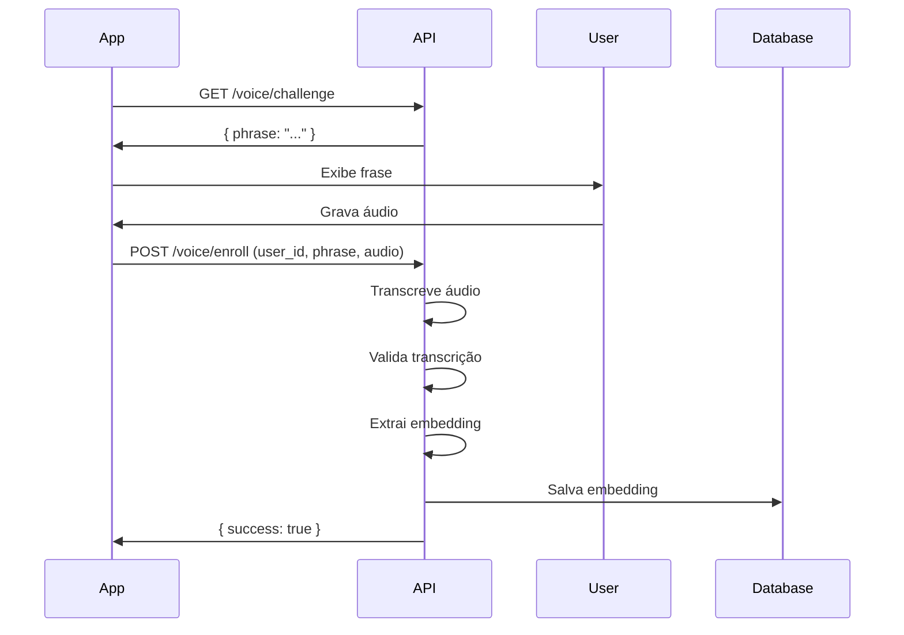
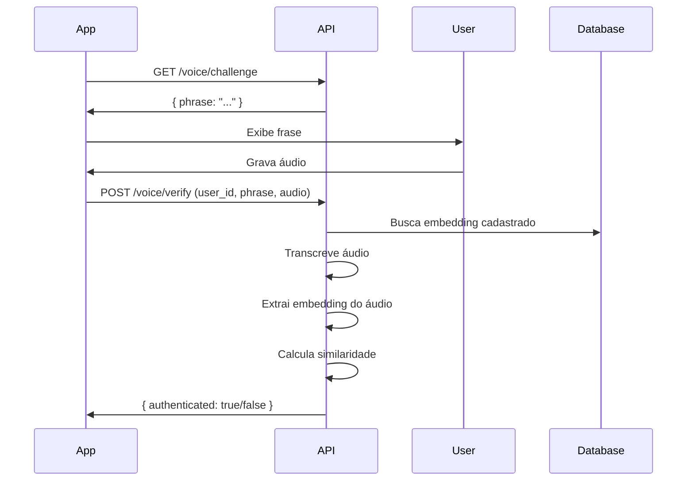

# 🔌 API Reference - Voice Authentication API

Documentação completa para desenvolvedores frontend integrando com a Voice Authentication API.

> 📱 **App de Exemplo**: [voice-auth-app](https://github.com/leonfagundes/voice-auth-app) - Aplicativo React Native/Expo demonstrando integração completa

---

## 📋 Índice

- [Base URL](#base-url)
- [Autenticação](#autenticação)
- [Endpoints](#endpoints)
- [Tipos de Dados](#tipos-de-dados)
- [Fluxo de Integração](#fluxo-de-integração)
- [Exemplos de Código](#exemplos-de-código)
- [Tratamento de Erros](#tratamento-de-erros)
- [Requisitos de Áudio](#requisitos-de-áudio)

---

## 🌐 Base URL

### Desenvolvimento Local
```
http://localhost:8000
```

### Desenvolvimento Mobile (Expo)
```
http://SEU_IP_LOCAL:8000
```
*Substitua `SEU_IP_LOCAL` pelo IP da sua máquina na rede local*

### Produção
```
https://api.seudominio.com
```

---

## 🔐 Autenticação

**Atualmente a API não requer autenticação**. Em produção, considere implementar:
- JWT tokens
- API Keys
- OAuth 2.0

---

## 📡 Endpoints

### 1. Health Check

Verifica se a API está funcionando.

#### Request
```http
GET /health
```

#### Response
```json
{
  "status": "healthy",
  "database": "connected"
}
```

#### Status Codes
- `200 OK` - API funcionando normalmente
- `500 Internal Server Error` - Problemas no servidor

#### Exemplo (JavaScript/Fetch)
```javascript
const response = await fetch('http://localhost:8000/health');
const data = await response.json();
console.log(data.status); // "healthy"
```

---

### 2. Get Challenge Phrase

Obtém uma frase aleatória para o usuário pronunciar.

#### Request
```http
GET /voice/challenge
```

#### Response
```json
{
  "phrase": "Eu autorizo o acesso ao sistema através da minha biometria vocal única e intransferível para garantir a máxima segurança"
}
```

#### Status Codes
- `200 OK` - Frase retornada com sucesso
- `500 Internal Server Error` - Erro ao gerar frase

#### Exemplo (JavaScript/Fetch)
```javascript
const response = await fetch('http://localhost:8000/voice/challenge');
const { phrase } = await response.json();
console.log(phrase);
```

#### Exemplo (Axios)
```javascript
import axios from 'axios';

const { data } = await axios.get('http://localhost:8000/voice/challenge');
console.log(data.phrase);
```

#### Exemplo (React Native/Expo)
```javascript
const getChallengePhrase = async () => {
  try {
    const response = await fetch(`${API_BASE_URL}/voice/challenge`);
    const data = await response.json();
    return data.phrase;
  } catch (error) {
    console.error('Erro ao obter frase:', error);
    throw error;
  }
};
```

---

### 3. Enroll User (Cadastro de Voz)

Cadastra o perfil de voz de um usuário.

#### Request
```http
POST /voice/enroll
Content-Type: multipart/form-data

user_id: string (required)
phrase_expected: string (required)
audio_file: File (required)
```

#### Parameters

| Campo | Tipo | Obrigatório | Descrição |
|-------|------|-------------|-----------|
| `user_id` | string | ✅ | ID único do usuário (ex: "user123", UUID) |
| `phrase_expected` | string | ✅ | Frase que o usuário deveria ter pronunciado |
| `audio_file` | File | ✅ | Arquivo de áudio WAV (mono, 16kHz recomendado) |

#### Response (Sucesso)
```json
{
  "success": true,
  "message": "Perfil de voz cadastrado com sucesso",
  "user_id": "user123",
  "transcription": "eu autorizo o acesso ao sistema através da minha biometria vocal única e intransferível para garantir a máxima segurança"
}
```

#### Response (Erro - Transcrição Incorreta)
```json
{
  "detail": "A frase pronunciada não corresponde à esperada",
  "transcription": "texto transcrito errado",
  "expected": "frase esperada"
}
```

#### Status Codes
- `200 OK` - Enrollment realizado com sucesso
- `400 Bad Request` - Erro de validação (formato, transcrição incorreta, arquivo vazio)
- `500 Internal Server Error` - Erro no processamento

#### Exemplo (JavaScript/FormData)
```javascript
const enrollUser = async (userId, phrase, audioBlob) => {
  const formData = new FormData();
  formData.append('user_id', userId);
  formData.append('phrase_expected', phrase);
  formData.append('audio_file', audioBlob, 'audio.wav');

  const response = await fetch('http://localhost:8000/voice/enroll', {
    method: 'POST',
    body: formData,
  });

  const result = await response.json();
  
  if (!response.ok) {
    throw new Error(result.detail || 'Erro no enrollment');
  }
  
  return result;
};
```

#### Exemplo (Axios)
```javascript
import axios from 'axios';

const enrollUser = async (userId, phrase, audioFile) => {
  const formData = new FormData();
  formData.append('user_id', userId);
  formData.append('phrase_expected', phrase);
  formData.append('audio_file', audioFile);

  const { data } = await axios.post(
    'http://localhost:8000/voice/enroll',
    formData,
    {
      headers: {
        'Content-Type': 'multipart/form-data',
      },
    }
  );

  return data;
};
```

#### Exemplo (React Native/Expo)
```javascript
import * as FileSystem from 'expo-file-system';

const enrollUser = async (userId, phrase, audioUri) => {
  const formData = new FormData();
  formData.append('user_id', userId);
  formData.append('phrase_expected', phrase);
  formData.append('audio_file', {
    uri: audioUri,
    type: 'audio/wav',
    name: 'audio.wav',
  });

  const response = await fetch(`${API_BASE_URL}/voice/enroll`, {
    method: 'POST',
    body: formData,
    headers: {
      'Content-Type': 'multipart/form-data',
    },
  });

  const result = await response.json();
  
  if (!response.ok) {
    throw new Error(result.detail);
  }
  
  return result;
};
```

---

### 4. Verify User (Autenticação por Voz)

Verifica a identidade de um usuário através da voz.

#### Request
```http
POST /voice/verify
Content-Type: multipart/form-data

user_id: string (required)
phrase_expected: string (required)
audio_file: File (required)
```

#### Parameters

| Campo | Tipo | Obrigatório | Descrição |
|-------|------|-------------|-----------|
| `user_id` | string | ✅ | ID do usuário a ser verificado |
| `phrase_expected` | string | ✅ | Frase que o usuário deveria ter pronunciado |
| `audio_file` | File | ✅ | Arquivo de áudio WAV |

#### Response (Autenticado)
```json
{
  "authenticated": true,
  "similarity": 0.8732,
  "threshold": 0.75,
  "message": "Autenticação bem-sucedida",
  "transcription": "eu autorizo o acesso ao sistema"
}
```

#### Response (Não Autenticado)
```json
{
  "authenticated": false,
  "similarity": 0.5234,
  "threshold": 0.75,
  "message": "Voz não reconhecida",
  "transcription": "eu autorizo o acesso ao sistema"
}
```

#### Response (Usuário Não Cadastrado)
```json
{
  "authenticated": false,
  "message": "Usuário não possui perfil de voz cadastrado"
}
```

#### Status Codes
- `200 OK` - Verificação processada (ver campo `authenticated`)
- `400 Bad Request` - Erro de validação
- `500 Internal Server Error` - Erro no processamento

#### Exemplo (JavaScript/Fetch)
```javascript
const verifyUser = async (userId, phrase, audioBlob) => {
  const formData = new FormData();
  formData.append('user_id', userId);
  formData.append('phrase_expected', phrase);
  formData.append('audio_file', audioBlob, 'audio.wav');

  const response = await fetch('http://localhost:8000/voice/verify', {
    method: 'POST',
    body: formData,
  });

  const result = await response.json();
  
  if (result.authenticated) {
    console.log('✅ Autenticado! Similaridade:', result.similarity);
  } else {
    console.log('❌ Não autenticado:', result.message);
  }
  
  return result;
};
```

#### Exemplo (React Native/Expo)
```javascript
const verifyUser = async (userId, phrase, audioUri) => {
  const formData = new FormData();
  formData.append('user_id', userId);
  formData.append('phrase_expected', phrase);
  formData.append('audio_file', {
    uri: audioUri,
    type: 'audio/wav',
    name: 'audio.wav',
  });

  const response = await fetch(`${API_BASE_URL}/voice/verify`, {
    method: 'POST',
    body: formData,
  });

  const result = await response.json();
  return result;
};
```

---

## 📊 Tipos de Dados

### ChallengeResponse
```typescript
interface ChallengeResponse {
  phrase: string;
}
```

### EnrollResponse
```typescript
interface EnrollResponse {
  success: boolean;
  message: string;
  user_id?: string;
  transcription?: string;
}
```

### VerifyResponse
```typescript
interface VerifyResponse {
  authenticated: boolean;
  similarity?: number;      // 0.0 a 1.0
  threshold?: number;       // 0.75 (padrão)
  message: string;
  transcription?: string;
}
```

### ErrorResponse
```typescript
interface ErrorResponse {
  detail: string;
  transcription?: string;
  expected?: string;
}
```

---

## 🔄 Fluxo de Integração

### Fluxo de Enrollment (Cadastro)



### Fluxo de Verificação (Login)



---

## 💻 Exemplos de Código

### React/Next.js - Hook Completo

```javascript
import { useState } from 'react';

const useVoiceAuth = (apiBaseUrl) => {
  const [loading, setLoading] = useState(false);
  const [error, setError] = useState(null);

  const getChallenge = async () => {
    setLoading(true);
    setError(null);
    
    try {
      const response = await fetch(`${apiBaseUrl}/voice/challenge`);
      const data = await response.json();
      return data.phrase;
    } catch (err) {
      setError(err.message);
      throw err;
    } finally {
      setLoading(false);
    }
  };

  const enrollUser = async (userId, phrase, audioBlob) => {
    setLoading(true);
    setError(null);
    
    try {
      const formData = new FormData();
      formData.append('user_id', userId);
      formData.append('phrase_expected', phrase);
      formData.append('audio_file', audioBlob, 'audio.wav');

      const response = await fetch(`${apiBaseUrl}/voice/enroll`, {
        method: 'POST',
        body: formData,
      });

      const result = await response.json();
      
      if (!response.ok) {
        throw new Error(result.detail || 'Erro no enrollment');
      }
      
      return result;
    } catch (err) {
      setError(err.message);
      throw err;
    } finally {
      setLoading(false);
    }
  };

  const verifyUser = async (userId, phrase, audioBlob) => {
    setLoading(true);
    setError(null);
    
    try {
      const formData = new FormData();
      formData.append('user_id', userId);
      formData.append('phrase_expected', phrase);
      formData.append('audio_file', audioBlob, 'audio.wav');

      const response = await fetch(`${apiBaseUrl}/voice/verify`, {
        method: 'POST',
        body: formData,
      });

      return await response.json();
    } catch (err) {
      setError(err.message);
      throw err;
    } finally {
      setLoading(false);
    }
  };

  return {
    loading,
    error,
    getChallenge,
    enrollUser,
    verifyUser,
  };
};

export default useVoiceAuth;
```

### React Native/Expo - Serviço Completo

Ver implementação completa em: [voice-auth-app](https://github.com/leonfagundes/voice-auth-app)

```javascript
import { Audio } from 'expo-av';

const API_BASE_URL = 'http://SEU_IP:8000';

export const VoiceAuthService = {
  async getChallenge() {
    const response = await fetch(`${API_BASE_URL}/voice/challenge`);
    const data = await response.json();
    return data.phrase;
  },

  async enrollUser(userId, phrase, audioUri) {
    const formData = new FormData();
    formData.append('user_id', userId);
    formData.append('phrase_expected', phrase);
    formData.append('audio_file', {
      uri: audioUri,
      type: 'audio/wav',
      name: 'audio.wav',
    });

    const response = await fetch(`${API_BASE_URL}/voice/enroll`, {
      method: 'POST',
      body: formData,
      headers: {
        'Content-Type': 'multipart/form-data',
      },
    });

    const result = await response.json();
    
    if (!response.ok) {
      throw new Error(result.detail);
    }
    
    return result;
  },

  async verifyUser(userId, phrase, audioUri) {
    const formData = new FormData();
    formData.append('user_id', userId);
    formData.append('phrase_expected', phrase);
    formData.append('audio_file', {
      uri: audioUri,
      type: 'audio/wav',
      name: 'audio.wav',
    });

    const response = await fetch(`${API_BASE_URL}/voice/verify`, {
      method: 'POST',
      body: formData,
    });

    return await response.json();
  },

  async recordAudio() {
    await Audio.requestPermissionsAsync();
    await Audio.setAudioModeAsync({
      allowsRecordingIOS: true,
      playsInSilentModeIOS: true,
    });

    const recording = new Audio.Recording();
    await recording.prepareToRecordAsync(
      Audio.RecordingOptionsPresets.HIGH_QUALITY
    );
    await recording.startAsync();
    
    return recording;
  },

  async stopRecording(recording) {
    await recording.stopAndUnloadAsync();
    const uri = recording.getURI();
    return uri;
  },
};
```

### Vue.js/Nuxt - Composable

```javascript
import { ref } from 'vue';

export const useVoiceAuth = () => {
  const loading = ref(false);
  const error = ref(null);
  const apiBaseUrl = 'http://localhost:8000';

  const getChallenge = async () => {
    loading.value = true;
    error.value = null;
    
    try {
      const response = await fetch(`${apiBaseUrl}/voice/challenge`);
      const data = await response.json();
      return data.phrase;
    } catch (err) {
      error.value = err.message;
      throw err;
    } finally {
      loading.value = false;
    }
  };

  const enrollUser = async (userId, phrase, audioBlob) => {
    loading.value = true;
    error.value = null;
    
    const formData = new FormData();
    formData.append('user_id', userId);
    formData.append('phrase_expected', phrase);
    formData.append('audio_file', audioBlob, 'audio.wav');

    try {
      const response = await fetch(`${apiBaseUrl}/voice/enroll`, {
        method: 'POST',
        body: formData,
      });

      const result = await response.json();
      
      if (!response.ok) {
        throw new Error(result.detail);
      }
      
      return result;
    } catch (err) {
      error.value = err.message;
      throw err;
    } finally {
      loading.value = false;
    }
  };

  const verifyUser = async (userId, phrase, audioBlob) => {
    loading.value = true;
    error.value = null;
    
    const formData = new FormData();
    formData.append('user_id', userId);
    formData.append('phrase_expected', phrase);
    formData.append('audio_file', audioBlob, 'audio.wav');

    try {
      const response = await fetch(`${apiBaseUrl}/voice/verify`, {
        method: 'POST',
        body: formData,
      });

      return await response.json();
    } catch (err) {
      error.value = err.message;
      throw err;
    } finally {
      loading.value = false;
    }
  };

  return {
    loading,
    error,
    getChallenge,
    enrollUser,
    verifyUser,
  };
};
```

---

## ⚠️ Tratamento de Erros

### Códigos de Status HTTP

| Status | Significado | Ação Recomendada |
|--------|-------------|------------------|
| 200 | OK | Processar resposta normalmente |
| 400 | Bad Request | Verificar parâmetros enviados |
| 404 | Not Found | Verificar URL do endpoint |
| 500 | Server Error | Tentar novamente ou contatar suporte |

### Erros Comuns

#### 1. Transcrição Incorreta
```json
{
  "detail": "A frase pronunciada não corresponde à esperada",
  "transcription": "texto errado",
  "expected": "texto correto"
}
```
**Solução**: Pedir ao usuário para falar mais claramente ou repetir.

#### 2. Arquivo de Áudio Inválido
```json
{
  "detail": "Formato de arquivo inválido. Envie um arquivo de áudio."
}
```
**Solução**: Garantir que o arquivo é WAV e tem Content-Type correto.

#### 3. Usuário Não Cadastrado
```json
{
  "authenticated": false,
  "message": "Usuário não possui perfil de voz cadastrado"
}
```
**Solução**: Redirecionar usuário para o fluxo de enrollment.

#### 4. Similaridade Baixa
```json
{
  "authenticated": false,
  "similarity": 0.65,
  "threshold": 0.75,
  "message": "Voz não reconhecida"
}
```
**Solução**: Pedir ao usuário para tentar novamente ou usar método alternativo de autenticação.

### Exemplo de Tratamento de Erros

```javascript
const handleVoiceVerification = async (userId, phrase, audioBlob) => {
  try {
    const result = await verifyUser(userId, phrase, audioBlob);
    
    if (result.authenticated) {
      // Autenticação bem-sucedida
      console.log('✅ Autenticado!');
      return { success: true };
    } else {
      // Não autenticado
      if (result.message.includes('não possui perfil')) {
        // Usuário não cadastrado
        return { success: false, reason: 'NOT_ENROLLED' };
      } else {
        // Voz não reconhecida
        return { success: false, reason: 'VOICE_NOT_RECOGNIZED', similarity: result.similarity };
      }
    }
  } catch (error) {
    if (error.message.includes('corresponde')) {
      // Transcrição incorreta
      return { success: false, reason: 'TRANSCRIPTION_FAILED' };
    } else if (error.message.includes('inválido')) {
      // Formato de arquivo inválido
      return { success: false, reason: 'INVALID_AUDIO_FORMAT' };
    } else {
      // Erro genérico
      return { success: false, reason: 'UNKNOWN_ERROR', error };
    }
  }
};
```

---

## 🎤 Requisitos de Áudio

### Formato Recomendado
- **Formato**: WAV (PCM)
- **Sample Rate**: 16kHz
- **Canais**: Mono (1 canal)
- **Bit Depth**: 16-bit
- **Duração**: 3-10 segundos

### Qualidade do Áudio
- ✅ Ambiente silencioso
- ✅ Microfone próximo à boca (10-20cm)
- ✅ Fala clara e natural
- ✅ Volume adequado (nem muito baixo, nem distorcido)
- ❌ Evitar ruído de fundo
- ❌ Evitar eco ou reverberação

### Gravação no Browser (Web Audio API)

```javascript
const recordAudio = async () => {
  const stream = await navigator.mediaDevices.getUserMedia({ 
    audio: {
      channelCount: 1,
      sampleRate: 16000,
      echoCancellation: true,
      noiseSuppression: true,
    } 
  });
  
  const mediaRecorder = new MediaRecorder(stream);
  const chunks = [];
  
  mediaRecorder.ondataavailable = (e) => chunks.push(e.data);
  
  mediaRecorder.onstop = async () => {
    const blob = new Blob(chunks, { type: 'audio/wav' });
    // Usar blob para enviar à API
  };
  
  mediaRecorder.start();
  
  // Parar após 5 segundos
  setTimeout(() => mediaRecorder.stop(), 5000);
};
```

### Gravação no React Native/Expo

```javascript
import { Audio } from 'expo-av';

const recordAudio = async () => {
  await Audio.requestPermissionsAsync();
  await Audio.setAudioModeAsync({
    allowsRecordingIOS: true,
    playsInSilentModeIOS: true,
  });

  const recording = new Audio.Recording();
  await recording.prepareToRecordAsync({
    android: {
      extension: '.wav',
      outputFormat: Audio.RECORDING_OPTION_ANDROID_OUTPUT_FORMAT_PCM_16BIT,
      audioEncoder: Audio.RECORDING_OPTION_ANDROID_AUDIO_ENCODER_PCM_16BIT,
      sampleRate: 16000,
      numberOfChannels: 1,
    },
    ios: {
      extension: '.wav',
      audioQuality: Audio.RECORDING_OPTION_IOS_AUDIO_QUALITY_HIGH,
      sampleRate: 16000,
      numberOfChannels: 1,
      linearPCMBitDepth: 16,
      linearPCMIsBigEndian: false,
      linearPCMIsFloat: false,
    },
  });
  
  await recording.startAsync();
  return recording;
};
```

---

## 🔗 Links Úteis

- **Swagger UI**: `http://localhost:8000/docs`
- **ReDoc**: `http://localhost:8000/redoc`
- **App de Exemplo**: [voice-auth-app](https://github.com/leonfagundes/voice-auth-app)
- **Documentação Completa**: [docs/README.md](./README.md)

---

## 💡 Dicas de Implementação

### 1. Use Timeout
```javascript
const fetchWithTimeout = (url, options, timeout = 30000) => {
  return Promise.race([
    fetch(url, options),
    new Promise((_, reject) =>
      setTimeout(() => reject(new Error('Timeout')), timeout)
    )
  ]);
};
```

### 2. Implemente Retry Logic
```javascript
const fetchWithRetry = async (url, options, retries = 3) => {
  for (let i = 0; i < retries; i++) {
    try {
      return await fetch(url, options);
    } catch (error) {
      if (i === retries - 1) throw error;
      await new Promise(resolve => setTimeout(resolve, 1000 * (i + 1)));
    }
  }
};
```

### 3. Feedback Visual ao Usuário
- Mostrar progresso durante upload
- Indicar quando está processando
- Exibir mensagens claras de erro
- Permitir cancelamento de operações

### 4. Validação Client-Side
- Verificar formato de áudio antes de enviar
- Validar duração do áudio (mínimo 2s, máximo 15s)
- Verificar tamanho do arquivo (máximo 10MB)

---

## 📞 Suporte

Para problemas ou dúvidas:
1. Consulte a [documentação completa](./README.md)
2. Veja o [app de exemplo](https://github.com/leonfagundes/voice-auth-app)
3. Abra uma issue no repositório

---

**Última atualização**: 20 de novembro de 2025
